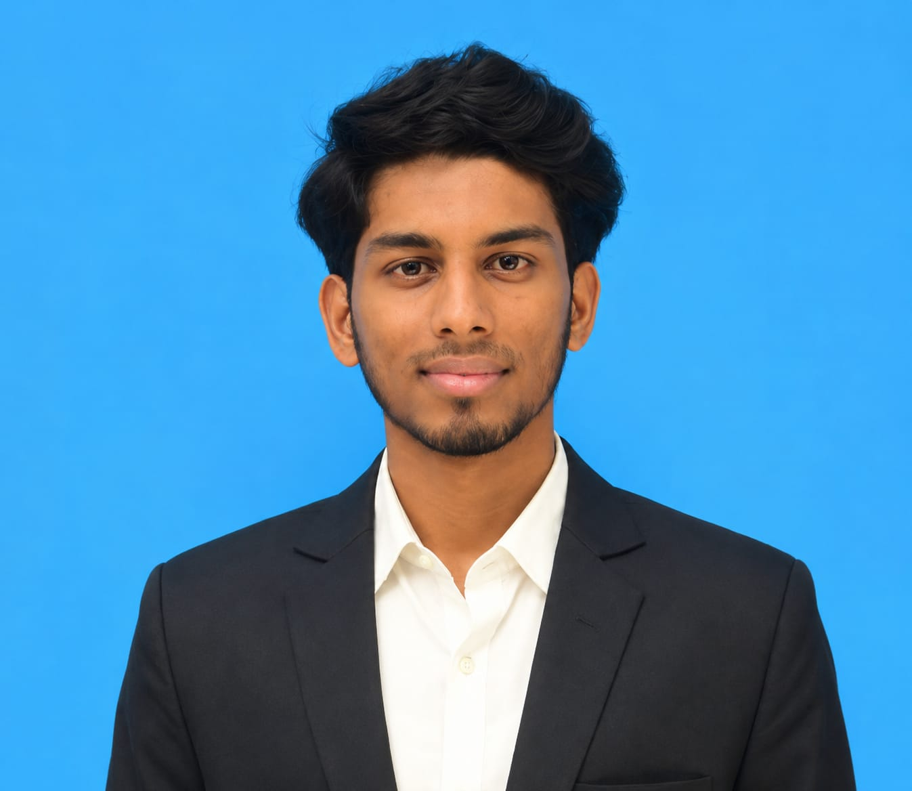

<div align="center">


<br/>


<br/><br/>

<a href="mailto:abdulwahith0818@gmail.com">
  
</a>

<a href="https://github.com/AbdulWahith18">
  
</a>

<a href="https://www.linkedin.com/in/abdul-wahith-m-aa8903373/">
  
</a>

<a href="https://github.com/AbdulWahith18/Wahith-Portfolio">
  
</a>


</div>

<br/>

<table>
<tr>

<td width="27%" align="center">



</td>

<td width="73%" valign="top">

## 🚀 About Me

Pre-final year **Computer Science** student at **Anna University, MIT Campus, Chennai**, with a strong interest in full-stack web development and data structures. Known for a hardworking attitude, team spirit, and problem-solving ability — I believe in **learning by building**, turning ideas into working products.

```yaml
role: Computer Science Undergraduate (2024 – 2028)
location: Tenkasi, Tamil Nadu, India
focus: [Full-Stack Development, DSA, Generative AI / RAG, Applied ML]
soft_skills: [Project Management, Adaptability, Leadership, Problem Solving, Public Speaking]
currently_building: Personal portfolio website (MERN stack)
